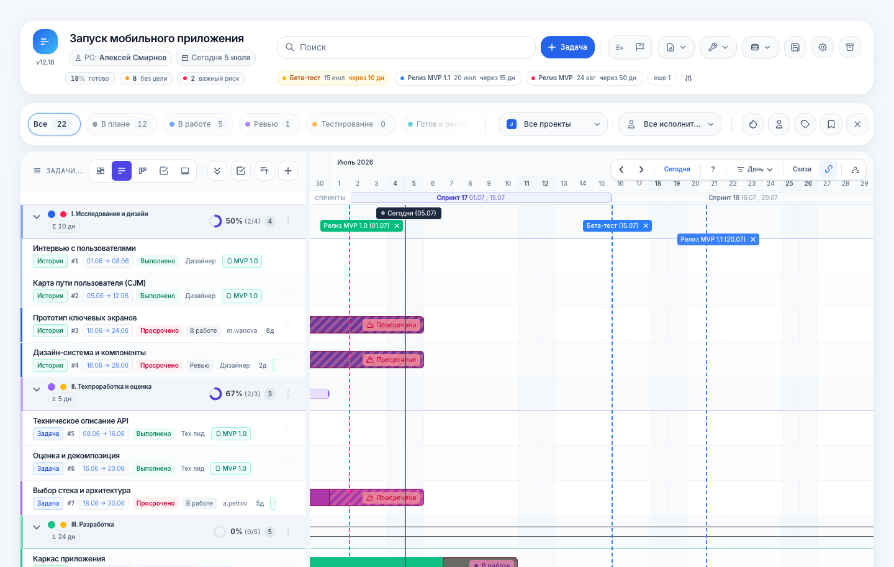
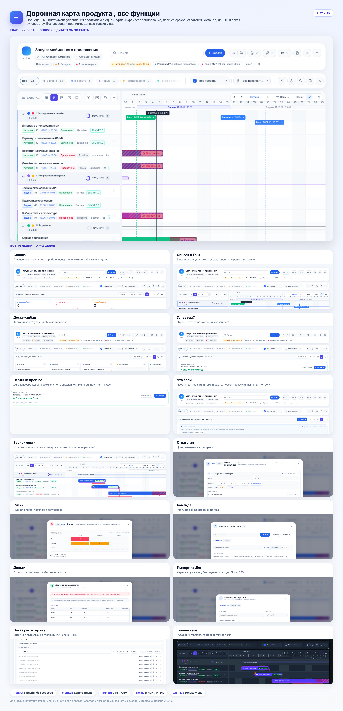

# Дорожная карта продукта

Наглядный план продукта в одном офлайн-файле: задачи и сроки, честный прогноз «Успеваем?», стратегия, команда, деньги и показ руководству. Без сервера и подписки, данные остаются только у вас.

**Открыть живую версию:** https://uchinin.github.io/roadmap/

## Что это

Полноценный инструмент управления дорожной картой, собранный в один HTML-файл. Открывается двойным кликом, работает без интернета, ничего не отправляет на сервер. Подходит и продакт-оунеру, который ведет план и следит за сроками, и команде, и руководству, которому нужен наглядный статус.

## Пять представлений одного плана

- **Сводка** , главное одним взглядом: в работе, просрочено, ближайшая дата, сигналы.
- **Список с диаграммой Ганта** , задачи слева, шкала справа, спринты и релизы.
- **Доска-канбан** , карточки по статусам, удобно на телефоне.
- **Успеваем?** , отдельная страница-ответ по каждой ключевой дате.
- **Презентация** , витрина роадмапа для показа руководству.

## Ключевые возможности

- **Честный прогноз сроков.** «Успеваем?» отвечает крупно и прямо: да с запасом, под вопросом или нет с опозданием. Считает по оценкам, зависимостям, отпускам и рабочим дням команды. Если данных мало, так и пишет, а не пугает мнимым срывом.
- **Песочница «Что если».** Подвигали темп, оценку или отпуск , сроки пересчитались сразу, реальный план при этом не трогается.
- **Зависимости** со стрелками, критический путь и подсветка нарушений.
- **Стратегический слой:** цели, инициативы, риски.
- **Команда** со ставками и занятостью, деньги, свой производственный календарь, свои поля.
- **Импорт из Jira** через вашу же открытую сессию, без отдельного входа и ключей. Плюс импорт из CSV.
- **Показ руководству:** витрина с выгрузкой на одну страницу PDF или в HTML.
- **Темная тема** и полностью русский интерфейс.

## Как устроено

- Один HTML-файл, около 3 МБ, работает офлайн.
- Ноль серверов, ноль подписок.
- Данные хранятся только у вас, в вашем файле, ничего не уходит в облако.

## Как открыть

Нажмите на живую версию по ссылке выше или откройте [index.html](index.html) в любом браузере. Онлайн-версия , это демо-режим на примере проекта: можно все потрогать, изменения не сохраняются.

## Оценки пользователей

По итогам синтетического опроса 1000 руководителей проектов и продуктов: Простота 9.13, Удовлетворенность 9.15, NPS +64, готовность внедрять 79.9 процента.
